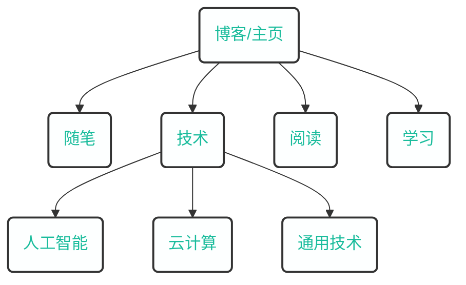

---
# the default layout is 'page'
icon: fas fa-info-circle
mermaid: true
order: 4
---

> Add Markdown syntax content to file `_tabs/about.md`{: .filepath } and it will show up on this page.
{: .prompt-tip }

煎茶[^1]，致力于打造原创，优质、有深度、有思考的内容分享网站。

本站采用世界上最快的网站建设框架[^2] [hugo](https://gohugo.io/)，基于 [PaperMod](https://github.com/adityatelange/hugo-PaperMod) 定制。

网站架构规划如下：

### 里程碑

- 2018.10.07，第一个域名（ `songtianlun.cn` ）
- 2019.01.27，第二个域名（ `frytea.com` ）
- 2019.11.19, 完成 `ICP` 备案: `粤 ICP 备 19144283 号`
- 2021.11.09, 正式签订[《十年之约》](https://www.foreverblog.cn)

## 关于我

这个不重要。

## 联系方式

- Email：[songtianlun@frytea.com](mailto:songtianlun@frytea.com)
- Telegram: [@songtianlun](https://t.me/songtianlun)
- GitHub: [@songtianlun](https://github.com/songtianlun)
- V2EX: [@Frytea](https://www.v2ex.com/member/Frytea)
- 即刻: [@煎茶_frytea](https://web.okjike.com/u/93f05b30-c2af-4096-b90e-32961464b881)
